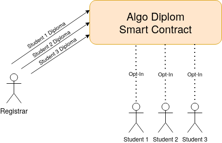

# Issuing University Diplomas on Algorand

## Usage

1. Set up `algod` and `goal` to connect to the testnet or a private network and create a few user accounts. Follow the tutorial for assistance: https://developer.algorand.org/docs/run-a-node/setup/install/

2. Install the required Python packages: `pip3 install -r requirements.txt`

3. Once you have a few test accounts with a balance,  list them in the `config.yml` file:

```yaml
registrar: "alice"

alice:
        mnemonic: "<MNEMONIC HERE>"

bob:
        mnemonic: "<MNEMONIC HERE>"

charlie:
        mnemonic: "<MNEMONIC HERE>"

APP_ID: -1
```

This example config file lists three users, of which `alice` is the registrar. The role of a registrar is to issue diplomas to the students, in this case `bob` and `charlie`. 

4. Make the PyTEAL contract code: `make`

5. Deploy the smart contract: `python3 run_diplom.py deploy`
This command will print an identifying number for `APP_ID`. Be sure to record this in the `config.yml`.

6. Use the DApp:
   - Issue a diploma to `bob`: `python3 run_diplom.py issue-diploma bob "MIT,2020,BSc,Computer Science and Engineering"`
   - Transfer registrar duties to `charlie`: `python3 run_diplom.py charlie` 
Be sure to update the registrar in the `config.yml` accordingly.
   - For more commands run: `python3 run_diplom.py help`

## Table of Contents

1. [Usage](#usage)
2. [Table of Contents](#table-of-contents)
3. [Overview](#overview)
4. [Explaining the DApp](#explaining-the-dapp)
   - [Roles](#roles)
   - [Smart Contract Code](#smart-contract-code)
     + [Storage](#storage)
     + [Overall DApp Architecture](#overall-dapp-architecture)
     + [Contract Logic](#contract-logic)
     + [Contract Initialization](#contract-initialization)
     + [Diploma Issuance](#diploma-issuance)
     + [Revoke Diploma](#revoke-diploma)
     + [Registrar Reassignment](#registrar-reassignment)
   - [DApp Interface Program](#dapp-interface-program)
     + [DApp Maintenance](#dapp-maintenance)
     + [DApp Common Usage](#dapp-common-usage)
     + [DApp Inspection](#dapp-inspection)
5. [Conclusion](#conclusion)

## Overview

<p align="center">
  
</p>

This DApp demonstrates how the Algorand blockchain can facilitate diploma issuance for graduating university students. Graduating students can opt-in to this DApp. And then a privelleged registrar account can issue specific dimplomas to specific students. Students get their diploma recorded under their account which any 3rd party can audit and verify its integrity. 

Additionally, the registrar can perform other operations for posterity. One such operation is transering registrar duties to another account. After such transfer, the designated account will become the new registrar and the old registrar will lose all priveleges. The registrar may also revoke diplomas if needed and also delete the entire DApp.

A detailed overview of all possible operations for both students and registrar can be found by running: `python3 run_diplom.py help`

## Explaining the DApp

### Roles

- Registrar: The admin of the DApp. The registrar can issue and revoke diplomas. They also have the power to update and delete the DApp from the blockchain.
- Student: A regular account in this DApp. They can receive a diploma from the registrar. They must opt-in to receive a diploma and have the option to leave the DApp at will.

### Smart Contract Code

This DApp is expressed as a stateful Algorand smart contract. It is written in [PyTEAL](https://pyteal.readthedocs.io/en/stable/overview.html "PyTEAL") following the suggested development [guidelines](https://developer.algorand.org/docs/reference/teal/guidelines/ "guidelines"). The smart contract source code is accessible [here](https://github.com/JSmith-BitFlipper/algo-diplom/blob/master/assets/diplom_smart_contract.py "here").

#### Storage
There is one global bytes field and one local bytes field (per optted-in account). The global field holds the address of the current registrar. The account with this address has all of the registrar privelleges of this DApp. The local field per account is where an issued diploma is recorded. A diploma is represented as a bytes array of common metadata such as issuing institution, year, degree title and type, etc.

#### Overall DApp Architecture
In this DApp, there is an account designated as a registrar and all other accounts are simply students. A global storage variable named `"registrar"` delinates which account is the registrar. A local storage variable in each account stores any issued diploma metadata. Accounts must opt-in to this DApp in order to receive a diploma if one is issued to them. 

This DApp implements a number of commands. A command is a sequence of PyTEAL operations which are called based on some conditional control-flow logic depending on a string argument passed in. Each command has it respective sanity checks, such as checking whether the caller is the registrar when necessary or the number of arguments supplied.

This DApp supports three commands, diploma issuance, diploma revocation and registrar reassignment. Diploma issuance is handled by writing the diploma metadata to the local storage of the account. Diploma revocation is handled by clearing the account local storage. Lastly, registrar reassignment is handled by overwriting the global storage `"registrar"` variable with the new registrar's accont address.

#### Contract Logic
```python
var_registrar = Bytes("registrar")
is_registrar = Txn.sender() == App.globalGet(var_registrar)

program = Cond(
        [Txn.application_id() == Int(0), init_contract],
        [Txn.on_completion() == OnComplete.DeleteApplication, Return(is_registrar)],
        [Txn.on_completion() == OnComplete.UpdateApplication, Return(is_registrar)],
        [Txn.on_completion() == OnComplete.OptIn, Return(Int(1))],
        [Txn.on_completion() == OnComplete.CloseOut, Return(Int(1))],
        [Txn.application_args[0] == Bytes("issue_diploma"), issue_diploma],
        [Txn.application_args[0] == Bytes("revoke_diploma"), revoke_diploma],
        [Txn.application_args[0] == Bytes("reassign_registrar"), reassign_registrar]
)
```

This is the contract logic which directs how the DApp reacts to certain commands. The following breakdown explains this logic line-by-line.
- `Txn.application_id() == Int(0)`: When a smart contract is initially deployed, the `Txn.application_id()` will be 0. This is the time to call `init_contract`to record the creator as the initial registrar of the DApp.
- `Txn.on_completion() == OnComplete.DeleteApplication`: Only allow the current registrar to delete this DApp.
- `Txn.on_completion() == OnComplete.UpdateApplication`: Only allow the current registrar to update this DApp.
- `Txn.on_completion() == OnComplete.OptIn`: Allow any account to opt-in to this DApp
- `Txn.on_completion() == OnComplete.CloseOut`: Allow any account to leave this DApp
- `Txn.application_args[0] == Bytes("issue_diploma")`: Run the `issue_diploma` logic of this DApp.
- `Txn.application_args[0] == Bytes("revoke_diploma")`: Run the `revoke_diploma` logic of this DApp.
- `Txn.application_args[0] == Bytes("reassign_registrar")`: Run the `reassign_registrar` logic of this DApp.

#### Contract Initialization

```python
init_contract = Seq([
        App.globalPut(var_registrar, Txn.sender()),
        Return(Int(1))
])
```

This block records the creator of the DApp as the initial registrar. This block is only called when `Txn.application_id() == Int(0)` signalling that the smart contract is currently being deployed. Thus the `Txn.sender()` is the creator account currently deploying the DApp.

#### Diploma Issuance

```python
diploma_metadata = Txn.application_args[1]
issue_diploma = Seq([
        Assert(is_registrar),
        Assert(Txn.application_args.length() == Int(2)),
        App.localPut(Int(1), Bytes("diploma"), diploma_metadata),
        Return(Int(1))
])
```

This block issues a diploma to an account. This code block is invoked by the `"issue_diploma"` command of this DApp. It takes an additional argument `diploma_metadata = Txn.application_args[1]` and an account `Int(1)` which is the account to receive the diploma metadata. The body of the block performs some sanity checks, that the caller is the registrar and that precisely two arguments are passed. If those checks pass, then the account at index 1, the one passed in, will receive the diploma metadata.

#### Revoke Diploma

```python
revoke_diploma = Seq([
        Assert(is_registrar),
        Assert(Txn.application_args.length() == Int(1)),
        App.localDel(Int(1), Bytes("diploma")),
        Return(Int(1))
])
```

This block revokes the diploma of an account. This code is invoked by the `"revoke_diploma"` command of this DApp. It takes no additional arguments, only an account `Int(1)` which is the account that will get its diploma revoked. Like above, the body of this block performs the same sanity checks, that the caller is the registrar and that there is only one argument passed. If these checks pass, then the account at index 1 will lose its diploma metadata.

#### Registrar Reassignment

```python
new_registrar = Txn.accounts[1]
reassign_registrar = Seq([
        Assert(is_registrar),
        Assert(Txn.application_args.length() == Int(1)),
        App.globalPut(var_registrar, new_registrar),
        Return(Int(1))
])
```

This block reassigns the registrar of this DApp. This code is invoked by the `"reassign_registrar"` command of this DApp. It takes no additional arguments, only an account `Txn.accounts[1]` which is the account that will become the new registrar. This block performs some sanity checks before reassigning the registrar.

### DApp Interface Program

This DApp is interfaced by a Python program using the Algorand SDK. This program is used to deploy the DApp as well as invoke the various DApp commands. Much of the SDK code and helper functions are borrowed from an example Algorand SDK app [here](https://github.com/algorand/docs/blob/master/examples/smart_contracts/v2/python/stateful_smart_contracts.py "here"). 

This SDK program has a host of functions. The help message from `python3 run_diplom.py help` lists the avaialble functions:
```
Available commands:
        deploy: Deploy this smart contract for the first time
        update: Update this smart contract with new TEAL code
        opt-in <account-name>: Opt-in an account into this smart contract
        close-out <account-name>: Close-out an account from this smart contract
        delete <creator-name>: Delete this smart contract
        clear <account-name>: Clear this smart contract
        issue-diploma <account-name> <diploma-metadata>: Issue a degree to an account
        revoke-diploma <account-name>: Nullify the diploma of an account
        inspect <account-name>: Inspect an account's diploma on the Algorand blockchain
        inspect-global <creator-name>: Inspect this smart contract's global state
        reassign-registrar <account-name>: Assign an account to be the current registrar
        help: Print this help message
```

Any arguments taken by each function is listed with angle brackets `<...>`.

#### DApp Maintenance

The `deploy`, `update`, `delete` and `clear` functions are used by a DApp administrator to maintain the DApp.

##### Deploy

Deployment of a smart contract begins with compiling the TEAL programs to a base64 encoded binary (the PyTEAL contract code is converted to TEAL by running `make`). 

```python
# Read the smart contract source files
smart_contract_file = open("./assets/diplom_smart_contract.teal", "rb")
smart_contract_source = smart_contract_file.read()
smart_contract_program = common.compile_program(algod_client, smart_contract_source)

clear_program_file = open("./assets/clear_program.teal", "rb")
clear_program_source = clear_program_file.read()
clear_program = common.compile_program(algod_client, clear_program_source)
```

Then a transaction is sent into the network signallying the deployment of a new smart contract. The creator of this DApp is the account that sends this transaction. In this case, the registrar at the time of deployment is the DApp creator. The formulation of this transaction is handled by the Python SDK.

```python
txn = transaction.ApplicationCreateTxn(
        sender, params, on_complete, \
        smart_contract_program, clear_program, \
        global_schema, local_schema)
```

The `global_schema` and `local_schema` outline how many global and local storage variables this contract will use. For this DApp, both only indicate one `Bytes` storage variable each.

##### Update

Updating the source code of this DApp begins with compiling the TEAL programs, similarly to deployment. However, the update event involves a different type of transaction. Most notably, the `app_id` of the DApp must be submitted to point to which DApp to update. Only the current registrar may update this DApp. The Python SDK creates the transaction to update a smart contract as follows:

```python
txn = transaction.ApplicationUpdateTxn(sender, params, app_id, \
                                        smart_contract_program, clear_program)
```

##### Delete

DApp deletion is performed by sending a specific transaction with the `app_id` of the DApp to be deleted. Only the current registrar may delete this DApp. This is handled concisely with the Python SDK.

```python
txn = transaction.ApplicationDeleteTxn(sender, params, app_id)
```

##### Clear

Any account can remove their participation from the DApp. This is done through sending a clearing transaction to the network. This implicity runs the `clear_program` of the DApp to perform any residual clean up and regardless if the clear program suceeds or not, the user will be removed from the DApp. The Python SDK creates the clear transaction as follows:

```python
txn = transaction.ApplicationClearStateTxn(sender, params, app_id)
```

#### DApp Common Usage

The `opt-in`, `close-out`, `issue-diploma`, `revoke-diploma` and `reassign-registrar` functions are the most common to be called by any user of this DApp.

##### Opt-In

Since this DApp utilizes local storage, any account wishing to participate in this DApp to receive a diploma must opt-in to it. This is performed by sending a specific opt-in transaction with the `app_id` of the DApp to join. The Python SDK creats the opt-in transaction as follows:

```python
txn = transaction.ApplicationOptInTxn(sender, params, app_id)
```

##### Close-Out

Separate from the clear function, an account can leave a DApp by closing out of it. An account leaves a DApp only if a close-out transaction with the corresponding `app_id` succeeds, differing form the clear function which unconditionally removes an account. In the case of this DApp, close-out always suceeds. The Python SDK creates the close-out transaction as follows:

```python
txn = transaction.ApplicationCloseOutTxn(sender, params, app_id)
```

##### Issue Diploma

The registrar issues a diploma by performing a call to the smart contract of this DApp. A call to the DApp is simply a transaction with the appropriate arguments required by the call. In the case of diploma issuance, that is the receiving account of the diploma as well as the diploma metadata -- degree type, institution, year, etc. This is fascilitated by the Python SDK as a NoOp application call as follows:

```python
txn = transaction.ApplicationNoOpTxn(sender, params, index, app_args, accounts)
```

The first argument of the `app_args` is the string `"issue-diploma"` which designates this call to issue a diploma.

##### Revoke Diploma

Similar to the diploma issuance, the registrar calls the DApp by sending a transaction with the appropriate arguments. In this case, this is only the account that will get its diploma revoked. This is fasciliated by the same Python SDK call as above, but where the first argument of the `app_args` is the string `"revoke-diploma"`.

##### Reassign Registrar

Similar to the other calls, registrar reassignment is a call to the DApp by the current registrar. Passed along is the account of the registrar to-be. The Python SDK call is the same as above, but the first argument of the `app_args` is the string `"reassign-registrar"`.

#### DApp Inspection

The `inspect` and `inspect-global` functions allow a third party to view the state variables of this DApp. These functions are most useful to determine the integrity and validity of some student's diploma for example.

##### Inspect

Any 3rd party with access to the Algorand blockchain can inspect an account's local storage to view their diploma. The `account` to inspect is passed in as an argument to the DApp Interface Program. The local `Bytes` storage variables are base 64 encoded, so inspection decodes the value to be human readable. A `read_local_state` helper function adopted from an example Algorand SDK app serves this function.

```python
common.read_local_state(algod_client, pub_keys[account], app_id)
```

##### Inspect Global

A 3rd party can also inspect the global `Bytes` storage variable to see the current registrar. Global variables are stored in the `creator` account, the account that deployed the DApp. The DApp Interface Program uses the registrar during deployment as the creator account. However, even after registrar reassignment, the original creator account must be passed in to inspect the global current registrar variable. A `read_global_state` helper function from an example Algorand SDK app serves this function.

```python
common.read_global_state(algod_client, pub_keys[creator], app_id)
```

## Conclusion

This DApp exemplifies a simple yet tanglible use-case for the Algorand blockchain. This diploma application is not complicated, yet covers many fundamental concepts for Algorand smart contract programming. Key concepts explored include:

- Writing a PyTEAL smart contract adhering to all of the best standard practices
  - Supports the full life cycle of a smart contract, from deployment to deletion
  - Multiple account types with differing privilege levels
  - Permission checking to ensure application security and integrity
  - Supports multiple commands with different behaviours
- Writing an interface program using an Algorand SDK
  - An easy interface to develop, maintain and use the DApp

**This solution is intended for learning purposes only. It does not cover error checking and other edge cases therefore, should not be used as a production application.**